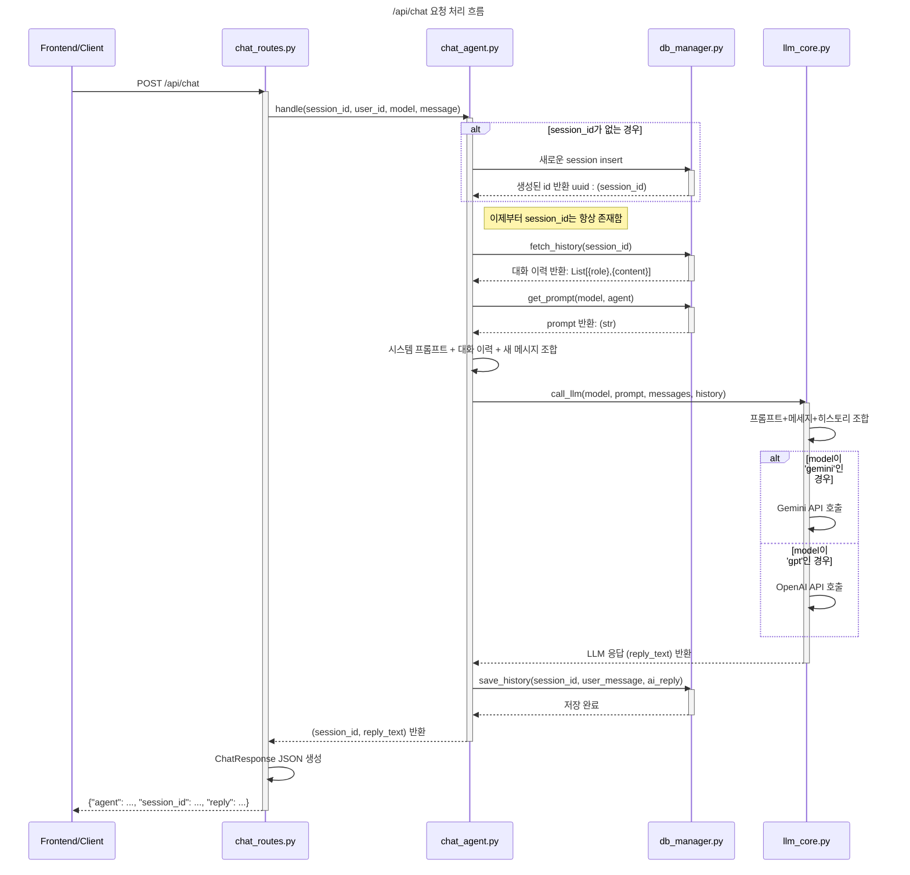

## RAG Multi-Agent 프로젝트

**프로젝트 설명:**

이 프로젝트는 RAG (Retrieval-Augmented Generation) 기술과 Multi-Agent 시스템을 활용하여 다양한 작업을 수행하는 것을 목표로 합니다. 현재 다음과 같은 기능을 제공합니다.

*   챗봇: 기본적인 질문 응답 기능
*   뉴스 검색: Naver News API를 이용하여 뉴스 검색 기능 제공

---

**기술 스택:**

*   Python
*   FastAPI
*   Langchain
*   Redis
*   OpenAI
*   Google Gemini

---

**설치 방법:**

1.  Python 3.8 이상 설치
2.  가상 환경 생성 (선택 사항): `python -m venv .venv`
3.  가상 환경 활성화:
    *   Linux/macOS: `source .venv/bin/activate`
    *   Windows: `.venv\Scripts\activate`
4.  패키지 설치: 
```sh
pip install -r requirements.txt`
```

---

**실행 방법:**

1. config 환경 설정:
     `.env` 파일 설정: `backend/.env` 파일을 복사하여 필요한 환경 변수를 설정합니다.
    e.g. 네이버 뉴스 API Key
    e.g. LLM 모델 key


2.  백엔드(FastAPI) 실행: 
```sh
uvicorn backend.main:app --reload`
# https://127.0.0.1:8000/docs  -> Swagger UI에서 Routes API 점검 (try out)

```
    
3. Docker + Redis 실행:
```sh
    # 먼저 Docker 실행 프로세스 확인
    docker ps -a
    # Redis 컨테이너가 Exited 상태라면: 
    docker start [Redis 컨테이너 이름 또는 ID]
    # 또는 Redis 컨테이너가 아예 없다면, 새로 실행 Docker 컨테이너 실행
    docker run --name my-redis-server -p 6379:6379 -d redis`
```
    
---

**API 엔드포인트:**

*   `/health`: 헬스 체크
*   `api/chat`: 챗봇 Agent API
*   `api/metting`: 회의실 Agent API


**Backend API 호출 시쿼스다이어긂**



**기여 방법:**


**라이선스:**

